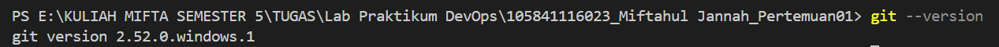
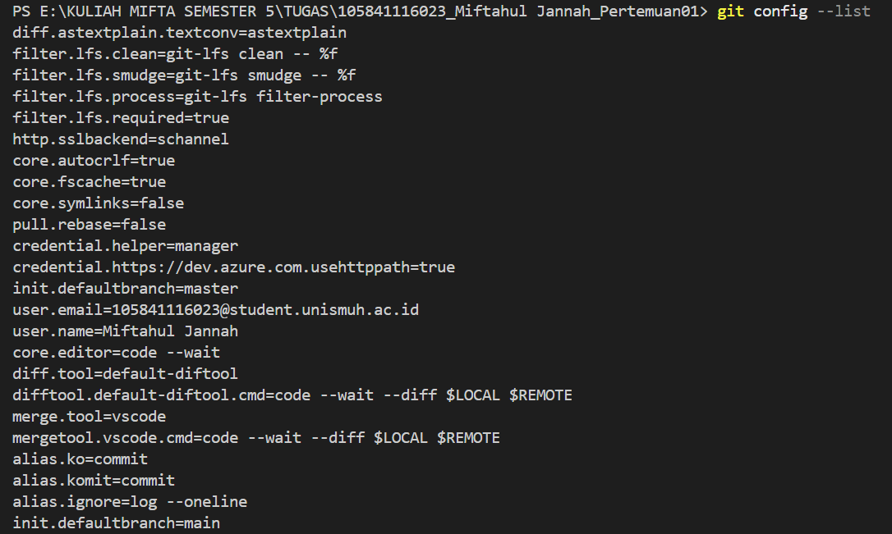
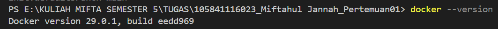
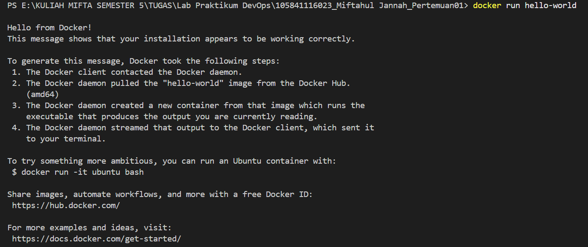
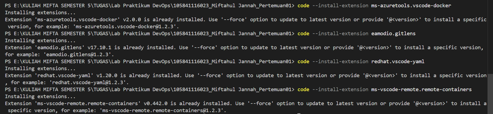

# 📋 Laporan Praktikum Pertemuan 01
## DevOps Culture & Principles

---

## 👤 Identitas Mahasiswa

| Item | Keterangan |
|------|------------|
| **Nama** | Miftahul Jannah |
| **NIM** | 105841116023 |
| **Kelas** | 5A |
| **Tanggal** | 2026-02-25 |

---

## 📚 Pemahaman DevOps

### Apa itu DevOps?

Menurut pemahaman saya, DevOps itu sebenarnya bukan nama sebuah software atau tools yang bisa kita install, melainkan sebuah budaya atau cara kerja baru di dunia IT. DevOps sendiri adalah singkatan dari Development (tim developer yang ngoding bikin aplikasi) dan Operations (tim yang ngurusin server dan jaringan). Dulu, kedua tim ini kerjanya terpisah dan sering banget saling menyalahkan kalau ada masalah. Misalnya, tim dev bilang kodenya sudah benar, tapi begitu dimasukkan ke server oleh tim ops, aplikasinya malah error atau crash. DevOps hadir untuk menghilangkan sekat ini. Lewat DevOps, kedua tim ini diajak kerja sama dan menggunakan otomatisasi agar proses bikin aplikasi, testing, sampai aplikasinya rilis ke server ( deployment) bisa berjalan mulus dan cepat.

### Mengapa DevOps Penting?

Di zaman sekarang, perusahaan teknologi dituntut untuk serba cepat. Kalau kita terlalu lama merilis fitur baru atau lambat memperbaiki bug, user pasti bakal kabur ke aplikasi saingan. Tapi masalahnya, kalau kita update aplikasi terlalu cepat dengan cara manual, risiko server down atau aplikasinya error itu sangat besar. Di sinilah letak pentingnya DevOps. Dengan praktik seperti CI/CD (Continuous Integration / Continuous Deployment), proses testing dan rilis aplikasi itu dibikin otomatis. Jadi, perusahaan bisa update aplikasi puluhan kali sehari dengan cepat, tapi tetap stabil dan minim error.

### Contoh Perusahaan yang Menerapkan DevOps

Contoh paling gampang dan keren menurut saya adalah Netflix. Netflix punya jutaan user yang streaming film tiap detik, tapi server mereka jarang mengalami down. Mereka sangat mengandalkan DevOps untuk melakukan ribuan update ke server setiap harinya tanpa mengganggu kita yang lagi nonton. Netflix juga membuat program yang bernama Chaos Monkey yang tugasnya sengaja mematikan server mereka secara acak. Tujuannya untuk mengetes apakah sistem mereka bisa langsung pulih secara otomatis saat ada masalah server.


---

## 🎯 Pemahaman Prinsip CALMS

C - Culture (Budaya): DevOps bukan sekadar tools, melainkan perubahan budaya kerja. Tim Development (Dev) dan Operations (Ops) harus bekerja sama, tidak lagi saling menyalahkan, dan memiliki tujuan yang sama.
Contoh penerapan: Membentuk tim gabungan di mana developer dan admin server duduk bersama (atau sering meeting rutin) untuk membahas perilisan aplikasi, sehingga developer ikut bertanggung jawab jika aplikasinya error di server.

A - Automation (Otomatisasi):
Mengurangi pekerjaan manual yang berulang-ulang dengan menggunakan skrip atau tools agar proses lebih cepat dan minim human error.
Contoh penerapan: Menggunakan CI/CD (Continuous Integration / Continuous Deployment) pipeline. Jadi, ketika developer selesai menulis kode dan menekan "Push" ke GitHub, sistem secara otomatis melakukan testing dan meng- upload kode tersebut ke server tanpa perlu dipindah manual pakai flashdisk atau FTP.

L - Lean (Ramping / Efisien):
Mengidentifikasi dan menghilangkan hal-hal yang membuang waktu (waste) dalam proses pembuatan software, serta merilis aplikasi secara bertahap.
Contoh penerapan: Daripada membuat aplikasi raksasa selama 1 tahun baru dirilis (yang berisiko banyak bug), perusahaan merilis fitur-fitur kecil setiap minggu agar bisa langsung dicoba oleh user dan mendapat feedback lebih cepat.

M - Measurement (Pengukuran):
Segala sesuatu harus bisa diukur. Kita tidak bisa memperbaiki apa yang tidak bisa kita ukur. Data ini penting untuk mengambil keputusan.
Contoh penerapan: Memasang tools monitoring seperti Grafana atau Prometheus di server. Jika memori server tiba-tiba melonjak 90% atau ada banyak user yang gagal login, tim bisa langsung melihat datanya dari grafik dan segera memperbaiki masalahnya sebelum server benar-benar mati.

S - Sharing (Berbagi):
Budaya berbagi pengetahuan, pengalaman, dan tools antar anggota tim agar tidak ada "ilmu yang terpusat hanya di satu orang".
Contoh penerapan: Membuat dokumentasi proyek yang sangat rapi (seperti file README.md yang sedang kamu buat ini), sehingga jika ada karyawan baru yang masuk ke tim, mereka bisa langsung paham cara menjalankan aplikasinya tanpa harus terus-terusan bertanya kepada karyawan lama.

---

## 🔧 Setup Development Environment

### Versi Software

| Software | Versi |
|----------|-------|
| Git | git version 2.52.0 |
| Docker | Docker version 29.0.1 |

### Konfigurasi Git

```
user.name: Miftahul Jannah
user.email: 105841116023@student.unismuh.ac.id

```

### VS Code Extensions

1. Docker
2. GitLens
3. YAML
4. Remote - Containers

### GitHub Account

- Username: miftaahul02

---

## 📸 Screenshots

| No | Screenshot | Keterangan |
|----|------------|------------|
| 1 |  | Output git --version |
| 2 |  | Output git config --list |
| 3 |  | Output docker --version |
| 4 |  | Output docker run hello-world |
| 5 |  | VS Code dengan extensions |

---

## 💭 Refleksi Pribadi

### Harapan dari Praktikum Ini

Jujur, dari praktikum DevOps ini, saya berharap banget bisa dapat ilmu praktis yang benar-benar kepakai di dunia kerja, bukan cuma sekadar teori di kelas. Selama ini kalau bikin tugas aplikasi, saya cuma fokus nulis kodenya aja, tapi kurang paham gimana cara yang benar untuk naikin aplikasi itu ke server biar bisa dipakai orang lain secara live. Saya berharap praktikum ini ngasih saya gambaran utuh tentang alur pengembangan software modern dari nol sampai rilis.

### Skill yang Ingin Dikuasai

Pada akhir semester, ada beberapa skill krusial yang sangat ingin saya kuasai secara praktis. Pertama, saya ingin mahir dalam menggunakan Git/GitHub untuk kolaborasi tim yang lancar tanpa adanya konflik kode yang merusak. Dan saya juga menargetkan untuk mampu menyusun rancangan otomatisasi dasar menggunakan CI/CD Pipeline, sehingga proses testing dan deployment aplikasi dapat berjalan secara otomatis ketika ada pembaruan kode.

### Tantangan yang Dihadapi

Tantangan terbesar yang saya hadapi dalam praktikum ini adalah pada saat melakukan proses push (mengirim tugas) ke repository GitHub Classroom. Saya juga sempat menemui kendala error saat mencoba melakukan push, yang ternyata disebabkan karena saya harus menarik data terbaru dari GitHub (git pull) terlebih dahulu agar file di laptop dan di GitHub sinkron.

---

## ✅ Checklist

- [x] Git terinstall dan terkonfigurasi dengan benar
- [x] Docker dapat menjalankan container hello-world
- [x] VS Code terinstall dengan semua extensions yang diminta
- [x] Laporan ditulis dengan bahasa yang baik dan benar
- [x] Semua screenshot jelas dan terbaca

---

*Laporan ini dibuat pada Rabu, 25 Februari 2026*
