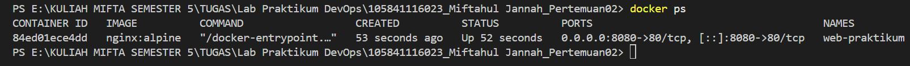
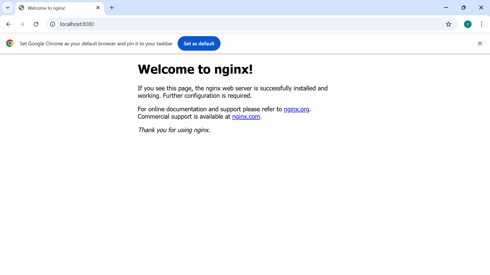
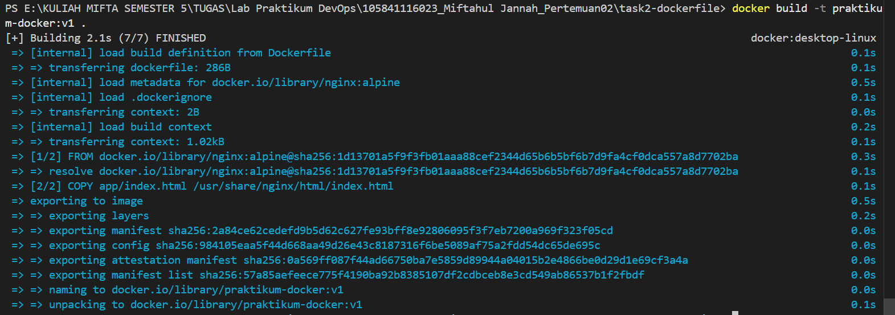
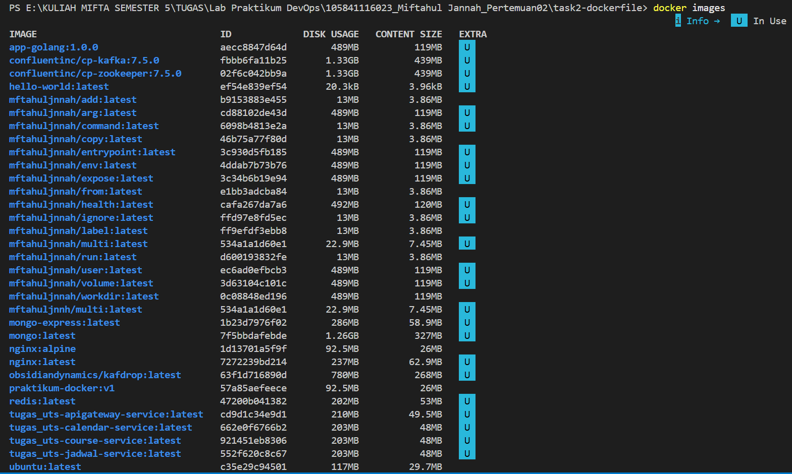
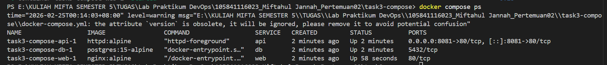
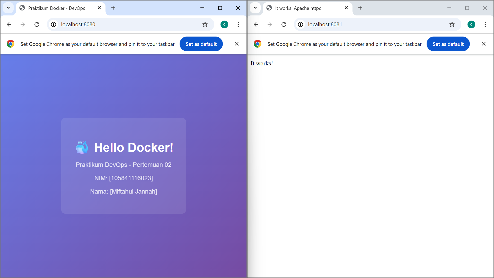

# Laporan Praktikum DevOps - Pertemuan 02

Nama  : [Miftahul Jannah]
NIM   : [505841116023]
Kelas : [RPL 5A]

---

# 📌 Task 1 - Docker Basic (Lifecycle Container)

## Tujuan
Memahami lifecycle container Docker mulai dari pull image, menjalankan container, melihat logs, hingga menghentikan dan menghapus container.

## Langkah yang Dilakukan
1. Pull image nginx:alpine
2. Menjalankan container dengan port mapping 8080:80
3. Mengecek container menggunakan docker ps
4. Mengakses nginx melalui browser
5. Melihat logs container
6. Masuk ke dalam container menggunakan docker exec
7. Stop dan remove container

## Hasil
Container berhasil dijalankan dan halaman default nginx dapat diakses melalui browser.

---

# 📌 Task 2 - Membuat Custom Docker Image

## Tujuan
Membuat Docker image sendiri menggunakan Dockerfile dan menjalankannya sebagai container.

## Langkah yang Dilakukan
1. Membuat folder project dan file index.html
2. Membuat Dockerfile berbasis nginx:alpine
3. Build image menggunakan docker build
4. Menjalankan container dari image yang dibuat
5. Mengakses hasil deployment melalui browser

## Hasil
Image berhasil dibuat dengan nama praktikum-docker:v1 dan halaman web custom berhasil ditampilkan.

---

# 📌 Task 3 - Docker Compose Multi-Container

## Tujuan
Menjalankan beberapa container sekaligus (web, api, dan database) menggunakan Docker Compose.

## Service yang Digunakan
- Web  : nginx
- API  : httpd
- DB   : postgres

## Langkah yang Dilakukan
1. Membuat file docker-compose.yml
2. Menjalankan docker compose up -d
3. Mengecek status container
4. Melihat logs
5. Mengakses web dan API melalui browser
6. Cleanup menggunakan docker compose down -v

## Hasil
Ketiga service berhasil berjalan dalam satu network dan dapat diakses melalui port yang telah ditentukan.

---

## 📸 Hasil Screenshot Praktikum

### Task 1: Eksplorasi Docker Dasar

**1. Output Container Berjalan (`docker ps`)**

**2. Tampilan Browser Mengakses Nginx**

### Task 2: Membuat Docker Image

**3. Output Build Image (`docker build`)**

**4. Custom Image Berhasil Dibuat (`docker images`)**

### Task 3: Docker Compose Multi-Container

**5. Status Compose Services (`docker compose ps`)**

**6. Tampilan Browser Multi-Service**

---

# Kesimpulan

Pada praktikum ini, saya mempelajari:
- Cara kerja lifecycle container Docker
- Cara membuat custom Docker image menggunakan Dockerfile
- Cara menjalankan multi-container menggunakan Docker Compose
- Konsep image, container, port mapping, volume, dan network

Docker mempermudah proses deployment aplikasi karena bersifat portable dan konsisten di berbagai environment.
